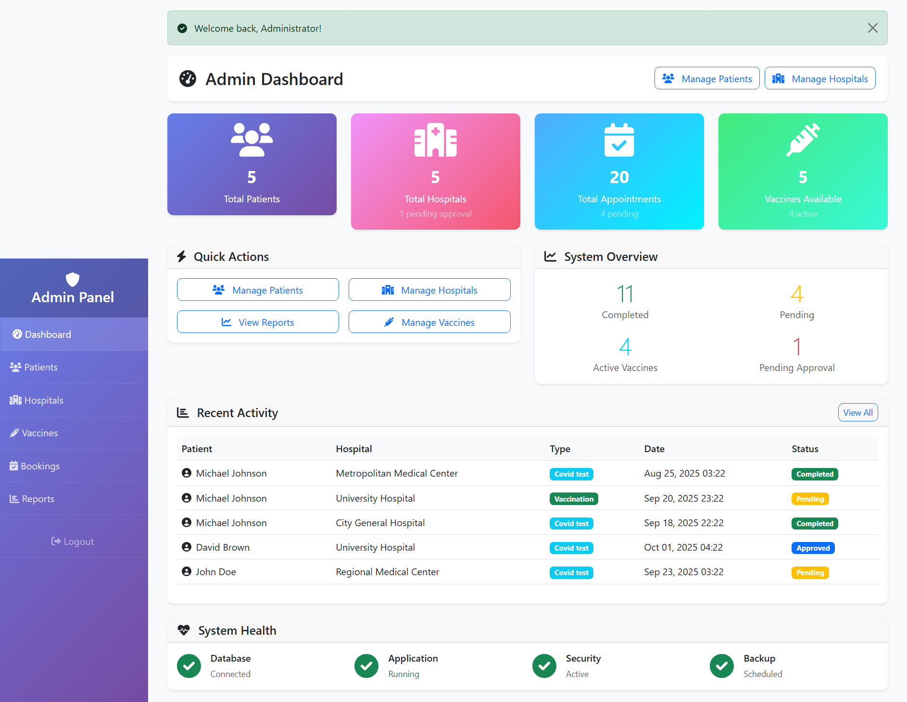
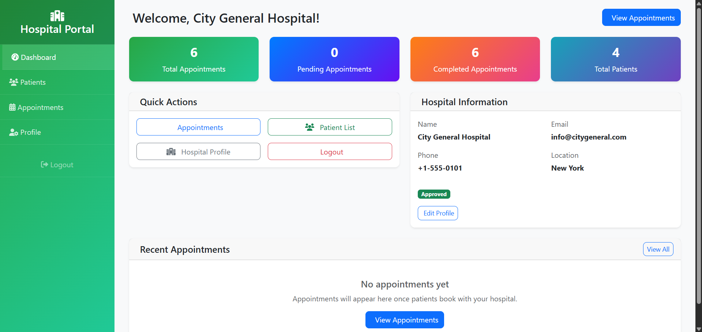
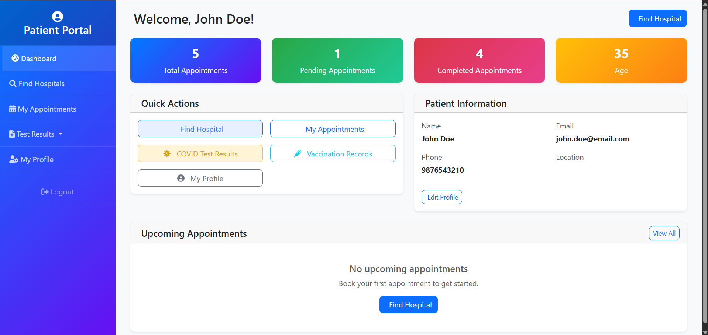

# 🏥 COVID-19 Test & Vaccination Management System  

  
  
  

---

## 📌 Table of Contents
- [🏥 COVID-19 Test \& Vaccination Management System](#-covid-19-test--vaccination-management-system)
  - [📌 Table of Contents](#-table-of-contents)
  - [📌 Overview](#-overview)
  - [🚀 Features](#-features)
    - [👨‍💼 Admin Module](#-admin-module)
    - [🏥 Hospital Module](#-hospital-module)
    - [👤 Patient Module](#-patient-module)
  - [📂 System Modules Summary](#-system-modules-summary)
  - [🛠️ Tech Stack](#️-tech-stack)
  - [📊 Reports \& Data Export](#-reports--data-export)
  - [📷 Screenshots (Optional)](#-screenshots-optional)
  - [](#)
  - [👨‍🏫 How to Run the Project](#-how-to-run-the-project)
  - [👨‍👩‍👧‍👦 Users of the System](#-users-of-the-system)
  - [🔮 Future Enhancements](#-future-enhancements)
  - [📌 Conclusion](#-conclusion)

---

## 📌 Overview  
The **COVID-19 Test & Vaccination Management System** is a web-based application designed to manage COVID-19 testing and vaccination records efficiently.  
It provides separate modules for **Admin**, **Hospitals**, and **Patients**, ensuring smooth operations for bookings, approvals, reporting, and result management.  

---

## 🚀 Features  

### 👨‍💼 Admin Module  
- View all patient details and profiles.  
- Generate reports of COVID-19 tests and vaccinations (date-wise, weekly, monthly).  
- Export reports in **XLS format**.  
- Manage vaccine availability (Available / Unavailable).  
- Approve or reject hospital login requests.  
- View and manage hospital details.  
- View booking details from patients for COVID-19 tests/vaccinations.  

### 🏥 Hospital Module  
- Register and login with hospital details (name, address, location).  
- View patient details for approved COVID-19 tests/vaccinations.  
- Manage patient requests (Approve / Reject).  
- Update COVID-19 test results.  
- Update vaccination status.  

### 👤 Patient Module  
- Register and login with personal details.  
- Search hospitals for COVID-19 tests or vaccinations.  
- Request COVID-19 test or vaccination at hospitals.  
- View test/vaccination reports.  
- Book hospital appointments.  
- Manage **My Appointments** (timing and hospital details).  
- View COVID-19 test results and vaccination suggestions.  
- Manage personal profile.  

---

## 📂 System Modules Summary  

| Module   | Features |
|----------|----------|
| **Admin** | Patient details, Reports, Vaccine list, Hospital approvals, Hospital list, Booking details |
| **Hospital** | Register/Login, Patient details, Approve/Reject requests, Update results & vaccination status |
| **Patient** | Register/Login, Search hospitals, Request services, Reports, Book appointments, View results, Profile management |

---

## 🛠️ Tech Stack  

- **Frontend:** HTML, CSS, JavaScript *(or React/Angular if used)*  
- **Backend:** PHP *(or Node.js/Python depending on implementation)*  
- **Database:** MySQL *(or MongoDB if NoSQL is used)*  
- **Tools:** WAMP/XAMPP, phpMyAdmin, Git  

---

## 📊 Reports & Data Export  
- COVID-19 test and vaccination reports can be exported by **Date, Week, and Month** in Excel format for analysis.  

---

## 📷 Screenshots (Optional)  
_Add screenshots of your UI here to showcase the project._  

Example placeholders:  
- **Admin Dashboard**  
- 
- **Hospital Portal**  
- 
- **Patient Portal**  

---

## 👨‍🏫 How to Run the Project  

1. Clone this repository:  
   ```bash
   git clone https://github.com/yourusername/covid-management-system.git
2. Import the database into **phpMyAdmin**.  
3. Update database credentials in the project configuration file.  
4. Run the project using **WAMP/XAMPP** or your preferred server.  

---

## 👨‍👩‍👧‍👦 Users of the System  

- **Admin** → Manage hospitals, patients, and reports.  
- **Hospital Staff** → Manage patients, requests, test results, and vaccination updates.  
- **Patients** → Book appointments, view results, and manage their profile.  

---

## 🔮 Future Enhancements  

- 📩 **Email & SMS Notifications** → Notify patients about test results and appointments.  
- 💳 **Online Payment Integration** → Allow patients to pay for tests/vaccinations online.  
- 📱 **Mobile App Version** → Extend services to Android/iOS for better accessibility.  
- 📊 **Advanced Analytics Dashboard** → Visualize vaccination trends, test statistics, and hospital capacity.  
- 🔒 **Role-Based Security** → Enhance access control for different system users.  
- ⏱ **Real-Time Vaccine Stock Updates** → Automatic updates of vaccine availability.  

---

## 📌 Conclusion  
This system simplifies the **COVID-19 test and vaccination management** process by integrating **Admin**, **Hospitals**, and **Patients** into a single platform.  
It ensures **efficiency, accuracy, and transparency** in handling pandemic-related data while providing scope for **future enhancements** like real-time updates, notifications, and mobile support.  

---